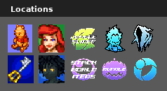
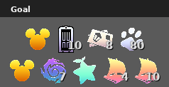

# Kingdom Hearts Final Mix AP Tracker

This is a [PopTracker](https://github.com/black-sliver/PopTracker/) Pack for Kingdom Hearts Final Mix to be used for the multiworld randomizer [Archipelago](https://archipelago.gg/).

## Settings

### Locations

The settings are divided into two sections. The first one shows the following location settings.

- **Pooh** and **Ariel** respectively control whether checks in the **Hundred Acre Wood** and **Atlantica** are included.
- **Jungle Slider** controls whether checks in the **Deep Jungle** jungle slider minigame are included.
- **Cups** and the **Phantom** silhouette control whether checks for **Olympus Coliseum Cups** and **Superbosses** are included.
- An activated **keyblade** controls whether world-specific keyblades are needed to open chests.
- **Anti Sora** is the toggle for **Logic Difficulty**. Checks that are out of logic will display as yellow on the map tracker. Logic options:
    - Beginner: Logic only expects what would be the natural solution in vanilla gameplay or similar, as well as a guarantee of tools for boss fights.
    - Normal: Logic expects some clever use of abilities, exploration of options, and competent combat ability; generally does not require advanced knowledge.
    - Proud: Logic expects advanced knowledge of tricks and obscure interactions, such as using Combo Master, Dumbo, and other unusual methods to reach locations.
    - Minimal: Logic expects the bare minimum to get to locations; may require extensive grinding, beating fights with no tools, and performing very difficult or tedious tricks.
- **Stacking World Items** and **Halloween Town Key Item Bundle** control how worlds and key items unlock locations.
- **Accessory** controls whether new party members have checks for randomized accessories.

All settings are loaded automatically when connecting the tracker to the AP server. Settings can also be changed manually to control which locations are displayed.

### Goal

The Goal section controls the requirements for unlocking the **End of the World**, opening the **Final Rest Door**.

The options for opening the **Final Rest Door** are:
- Find an amount of lucky emblems  specified as the number overlayed on 
- Defeat Sephiroth 
- Defeat Unknown 
- Send an amount of Postcards 
- Rescue an amount of Puppies 
- Open the chest in End of the World Final Rest 

The options for unlocking the **End of the World** are:
- Find a certain amount of lucky emblems  specified as the number overlayed on 
- Find the world as an item 

The Goal section also contains settings to control whether **Destiny Islands**  is required to reach the final bosses as well as the required amount of raft materials 

These settings are loaded automatically when connecting the tracker to the AP server. Settings can also be changed manually to control which locations are displayed.

## Feedback

Feedback is always appreciated. If there is an issue with the tracker, either open an issue here on github or contact me via Discord.

## Credits

Icons were made by [Televo](https://github.com/Televo/kingdom-hearts-recollection) or taken from CoM rips by [GaryCXJk](https://www.spriters-resource.com/submitter/GaryCXJk/).
